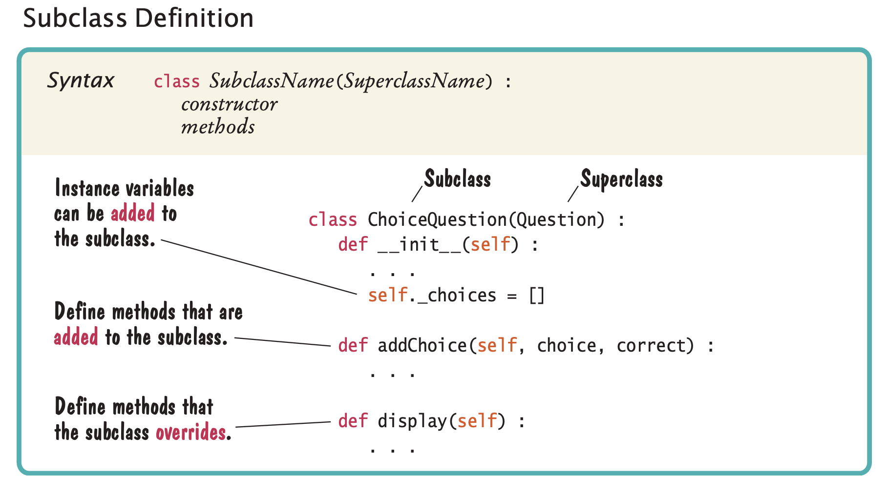

# Inheritance

- In object-oriented design, inheritance is a relationship between a more general class
  (called the superclass) and a more specialized class (called the subclass).
- The subclass inherits data and behavior from the superclass. For ex, a `Car` is a 
  sub class of `Vehicle`.
- We say that the class `Car` inherits from the class `Vehicle`.
- The substitution principle states that you can always use a subclass object when a 
  superclass object is expected. For example, `processVehicle(vehicle)`.
- Because Car is a subclass of Vehicle, you can call that function with a Car object:
```
myCar = Car(. . .)
processVehicle(myCar)
```
- In general, when classes are grouped into inheritance hierarchy, the common code is
  written in super class, such that it can be shared in all sub classes.

# Inheritance with Quiz questions

- Let's take an example of Quiz to explain inheritance. A quiz consists of questions, 
  and there are different kinds of questions:
  - Fill-in-the-blank
  - Choice (single or multiple)
  - Numeric (where an approximate answer is ok; e.g., 1.33 when the actual answer is 4/3)
  - Free response
    
- Here is the complete code of `questions.py` file.
```
##
#  This module defines a class that models exam questions. 
#

## A question with a text and an answer.
#
class Question:
    ## Constructs a question with empty question and answer strings.
    #
    def __init__(self):
        self._text = ""
        self._answer = ""

    ##  Sets the question text.
    #   @param questionText the text of this question
    #
    def setText(self, questionText):
        self._text = questionText

    ## Sets the answer for this question.
    #  @param correctResponse the answer
    #
    def setAnswer(self, correctResponse):
        self._answer = correctResponse

    ## Checks a given response for correctness.
    #  @param response the response to check
    #  @return True if the response was correct, False otherwise
    #
    def checkAnswer(self, response):
        return response == self._answer

    ## Displays this question.
    #
    def display(self):
        print(self._text)

```

## When to use inheritance

- The purpose of inheritance is to model objects with different behavior.
- Consider a program that tracks the fuel efficiency of a fleet of cars by logging 
  the distance traveled and the refueling amounts. 
  - Some cars in the fleet are hybrids. Should you create a subclass HybridCar?
  - No. Hybrids don’t behave any differently than other cars when it comes to 
    driving and refuelling. 
  - A single `Car` class with an instance variable `milesPerGallon` is enough.
- If we write a program that shows how to repair different kinds of vehicles, then
  it makes sense to have a separate class HybridCar, because hybrid cars behave 
  differently from normal cars.
- So the underlying principle is `Use a Single Class for Variation in Values, 
  Inheritance for Variation in Behavior`.

## The Cosmic Superclass: object

- In Python, every class that is declared without an explicit superclass automatically
  extends the class object as in `java`.
- The object class defines several very general methods. 
-  For ex, the `__repr__` method. By default, this includes the name of the class from
   which the object was created and the name of the module in which the class was defined.
```
first = Question() 
second = Question() 
print(first) # we know print and str methods internally call __repr__(self)
print(second)

O/P:
<questions.Question object at 0xb7498d2c> 
<questions.Question object at 0xb7498d4c>
```
- The `__repr__` method is often overridden in subclasses for use in debugging. For ex,
```
class Question : .. .
  def __repr__(self) :
    return "Question[%s, %s]" % (self._text, self._answer)
```
- We can create test objects and print them to verify that they contain the 
  correct data:
```
q = Question() 
print("Created object:", q)
q.setText("Who was the inventor of Python?") 
print("Added the text:", q) 
q.setAnswer("Guido van Rossum")
print("Added the answer:", q)

O/P:
Created object: Question[, ]
Added the text: Question[Who was the inventor of Python?, ]
Added the answer: Question[Who was the inventor of Python?, Guido van Rossum]
```
# Implementing Subclasses

- Suppose you want to handle questions with choice. We don't need to write a new 
  class from scratch for this. We can use inheritance and implement ChoiceQuestion as
  a subclass of Question.
  - The subclass inherits all methods from the superclass.
  - Define any methods that are new to the subclass.
  - Change the implementation of inherited methods if the inherited behavior is 
    not appropriate. This is also called overriding.
- A ChoiceQuestion object differs from a Question object in three ways:
  - Its objects store the various choices for the answer.
  - There is a method for adding answer choices.
  - The display method of the ChoiceQuestion class shows these choices so that 
    the respondent can choose one of them.
    
    

## Implementing ChoiceQuestion methods

- `ChoiceQuestion` has the `_text` and `_answer` instance variables that are declared
  in the Question superclass, and it adds an instance variable, `_choices`.
- It also adds a new method `addChoice`.
- It overrides `display` method, so that choices can be appropriately displayed.

### Implementing addChoice method

- The method has two arguments: the choice to be added and boolean value to indicate
  whether the choice is correct. `question.addChoice("Canada", True)`.
  - The first argument is added to the _choices instance variable. 
  - If the second argument is True, then the _answer instance variable becomes the 
    number of the current choice.
  - For example, if len(self._choices) is 2, then _answer is set to the string "2".
```
def addChoice(self, choice, correct) : 
  self._choices.append(choice)
  if correct :
  # Convert the length of the list to a string. 
    choiceString = str(len(self._choices)) 
    self.setAnswer(choiceString) # Should not access _answer variable directly.
```
## Calling the superclass constructor

- A subclass constructor can only define the instance variables of the subclass. 
- The superclass instance variables also need to be defined.
- The superclass is responsible for defining its own instance variables. 
- Because this is done within its constructor, the constructor of the subclass 
  must explicitly call the superclass constructor. 
- To call the superclass constructor use `super()`. For ex:
```
class ChoiceQuestion(Question) : 
  def __init__(self) :
    super()._ _init_ _() 
    self._choices = []
```
- The superclass constructor should be called before the subclass defines its own 
  instance variables.
- The self reference must still be used to define the instance variables of the 
  subclass.
- If a superclass constructor requires arguments, you must provide those as arguments
  to the __init__ method. For ex,
```
class ChoiceQuestion(Question) :
  def __init__(self, questionText) :
    super()._ _init_ _(questionText) 
    self._choices = []
```  

## Overriding methods

- If the behavior of the superclass is not sufficient, we override it by 
  specifying a new implementation in the subclass.
- Consider the display method of the ChoiceQuestion class.
  - It overrides the display method in order to show the choices for the answer.
  - The method needs to
    - Display the question text. 
    - Display the answer choices.
```
class ChoiceQuestion(Question) : .. .
  def display(self) :
    # Display the question text.
    super().display() # Can't access _text directly, use super().display()
    # Display the answer choices.
    for i in range(len(self._choices)) :
      choiceNumber = i + 1
      print("%d: %s" % (choiceNumber, self._choices[i]))
```
- The complete code can be seen in the source files `quetiondemo2.py` and 
  `choicequestions.py`.

# Polymorphism

- If we need to write a program that shows mixture of both `Question` and `ChoiceQuestion`
  we need not know the exact type of the question.
- With inheritance this behavior is easy to achieve.
- We can define the presentQuestion function in the test class to expect a 
  Question type object:
```
def presentQuestion(q) : 
  q.display()
  response = input("Your answer: ") 
  print(q.checkAnswer(response))
```  
- The `q.display()` invokes method based on the type of the object passed.
- Method calls are always determined at run time based on the type of the actual 
  object. This is called dynamic method lookup.
- Dynamic method lookup allows us to treat objects of different classes in a 
  uniform way. This is called polymorphism.  
- We can substitute a subclass object whenever a superclass object is expected:
```
second = ChoiceQuestion()
presentQuestion(second) # OK to pass a ChoiceQuestion
```
- We cannot substitute a superclass object when a subclass object is expected.

# Subclasses and Instances

- In the `presentQuestion` we need to verify if the instance passed to the method is
  of `Question` type or any of its subclasses. To do this, we can use `isIntance` method.
```
def presentQuestion(q) :
  if not isintance(q, Question) :
    raise TypeError("The argument is not a Question or one of its subclasses.")
    q.display()
    response = input("Your answer: ") print(q.checkAnswer(response))
    
#Test
first = Question()
second = ChoiceQuestion()
.. .
presentQuestion(first) # OK
presentQuestion(second) # OK—subclass of Question. 
presentQuestion(5) # Error—an integer is not a subclass of Question.    
```  

# Abstract classes

- Sometimes, it is desirable to force programmers to override a method. 
- That happens when there is no good default for the superclass, and only the subclass
  programmer can know how to implement the method properly. For ex,
```
class Account : .. .
  def deductFees(self) :
```
- A programmer implementing a new subclass might simply forget to implement the 
  `deductFees` method, and the new account would inherit the do-nothing method of 
  the superclass.
- There is a better way to implement abstract method
```
class Account : .. .
  def deductFees(self) :
    raise NotImplementedError
```
- A class that contains at least one abstract method is known as an abstract class.
- In other object-oriented languages like java, the missing implementation is 
  discovered at compile time and throws error. We don't have such mechanism in python.

  
  


  