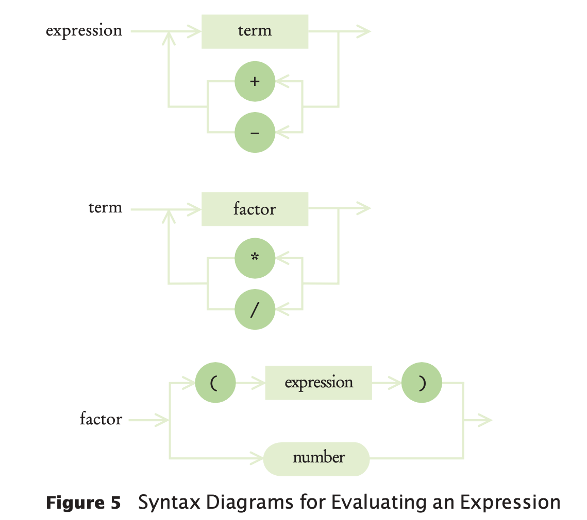

# Towers of Hanoi Problem

- The “Towers of Hanoi” puzzle has a board with three pegs and a stack of disks of decreasing
  size, initially on the first peg.
- The goal is to move all disks to the third peg.
  - One disk can be moved at one time, from any peg to any other peg. 
  - Place smaller disks only on top of larger ones, not the other way around.
    
## Algorithm

- Consider the problem of moving d disks from peg p1 to peg p2, where p1 and p2 
  can be any of 1, 2, or 3, and p1 ≠ p2.
- Because 1 + 2 + 3 = 6, To get the index of remaining peg p3 = 6 - p1 - p2.
- Now we can move the disks as follows:
  1. Move the top d – 1 disks from p1 to p3
  1. Move one disk (the one on the bottom of the pile of d disks) from p1 to p2
  1. Move the d – 1 disks that were parked on p3 to p2
- From the above procedure we can handle the first and third step recursively, but because 
  we move one fewer disk(d-1), the recursion will eventually terminate.
  
## Solution

- Each disk is represented as an integer indicating its size from 1 to n, the no of disks
  in the puzzle.
- There are three towers, so a configuration of the puzzle is a list of three lists, such 
  as this one:  
```
[[5, 2], [4, 1], [3]]
```  
- The move function carries out the move, then prints the contents of the towers:
```python
def move(towers, disks, fromPeg, toPeg) : 
    if disks > 0 :
        other = 3 - fromPeg - toPeg 
        move(towers, disks - 1, fromPeg, other) 
        diskToMove = towers[fromPeg].pop() 
        towers[toPeg].append(diskToMove) 
        print(towers)
        move(towers, disks - 1, other, toPeg)
```
- Here the index values are 0, 1, 2. Therefore, the index of the other peg is 
  `3 - fromPeg - toPeg`.
- The main function is
```
def main() : 
    NDISKS = 5
    towers = [list(range(1, NDISKS + 1)), [], []] 
    print(towers)
    move(towers, NDISKS, 0, 2)
```
- The complete source code is at [Towers of hanoi solution](./src/chapter11/towersofhanoi.py)  

# Mutual Recursion

- Sometimes, a set of cooperating functions or methods calls each other in a recursive fashion. 
- This technique is significantly more advanced than the simple recursion.
- Let's develop a program that can compute the values of arithmetic expressions such as,
```
3+4*5
(3+4)*5 
1-(2-(3-(4-5)))
```
- Computing above expressions is complicated because 
  - `*` and `/` bind more strongly than `+` and `-`
  - parentheses can be used to group subexpressions.
  
## Syntax diagram

- Below figure shows a set of syntax diagrams that describes the syntax of the expressions.
  
- To see how the syntax diagrams work, consider the expression 3+4*5:
  - Enter the expression syntax diagram. The arrow points directly to term, with no alternative.
  - Enter the term syntax diagram. The arrow points to factor, again with no choice.
  - Enter the factor diagram. There are two choices: 
    - To follow the top branch or the bottom branch. 
      - Because the first input token is the number 3 and not a (, follow the bottom branch.
  - Accept the input token because it matches the number. The unprocessed input is now `+4*5`.
  - Follow the arrow out of number to the end of factor. As in a function call, 
    now back up, returning to the end of the factor element of the term diagram.
  - Now the choices are either to loop back in the term diagram, or to exit. 
    - The next input token is a `+`, and it matches neither the `*` or the `/`. So exit, 
      returning to expression.
  - Again, there are two choices: 
    - To loop back or to exit. 
    - Now the `+` matches one of the choices in the loop. Accept the `+` in the input 
      and move back to the term element. The remaining input is `4*5`.
- These steps can be breakdown as a tree.
  

## Why syntax diagrams are useful

- Syntax diagrams accurately represent which operations should be carried out first. 
  - In the first tree, 4 and 5 should be multiplied, and then the result should be added to 3.
  - In the second tree, 3 and 4 should be added, and the result should be multiplied by 5.

## Solution

- To compute the value of an expression, we implement three functions: expression, term,
  and factor.

### The `expression` function

- The expression function first calls term to get the value of the first term of the 
  expression.
- Then it checks whether the next input token is one of `+` or `-`.
- If so, it calls term again and adds or subtracts it.
```python
def expression(tokens) :
    value = term(tokens)
    done = False
    while not done and len(tokens) > 0 :
        next = tokens[0]
        if next == "+" or next == "-" :
            tokens.pop(0) # Discard "+" or "-" 
            value2 = term(tokens)
            if next == "+" :
                value = value + value2
            else :
                value = value - value2
        else :
            done = True
        
    return value
```

### The `term` function

- The term function calls factor in the same way, multiplying or dividing the factor values.
```python
def term(tokens) :
  value = factor(tokens)
  done = False
  while not done and len(tokens) > 0 :
    next = tokens[0]
    if next == "*" or next == "/" : 
      tokens.pop(0)
      value2 = factor(tokens)
      if next == "*" :
        value = value * value2 
      else :
        value = value / value2 
    else :
      done = True
    
  return value    
```

### The factor function
- The factor function checks whether the next token is a `(`.
  - If the next token is a `(`, the factor function makes a recursive call to expression.
  - Thus, the three methods are mutually recursive.
- If not, the token must be a number, and the value is simply that number.
```
def factor(tokens) : 
  next = tokens.pop(0) 
  if next == "(" :
    value = expression(tokens)
    tokens.pop(0) # Discard ")" 
  else :
    value = next 
  
  return value
```

### Tracing the mutual recursion

- To see the mutual recursion clearly, trace through the expression (3+4)*5:
  - expression calls term 
    - term calls factor
      - factor consumes the ( input
      - factor calls expression
        - expression returns eventually with the value of 7, having consumed 3 + 4. 
          This is the recursive call.
      - factor consumes the ) input
      - factor returns 7
    - term consumes the inputs * and 5 and returns 35
  - expression returns 35