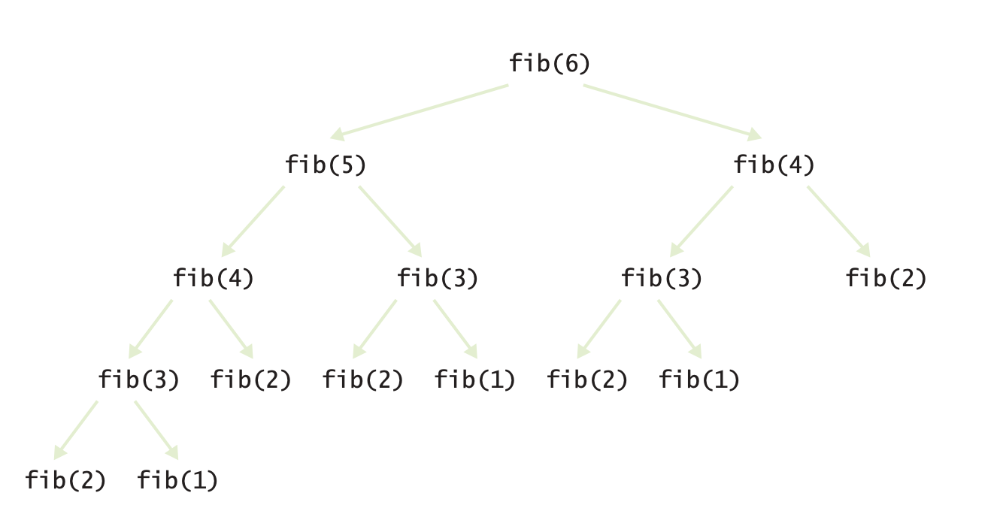
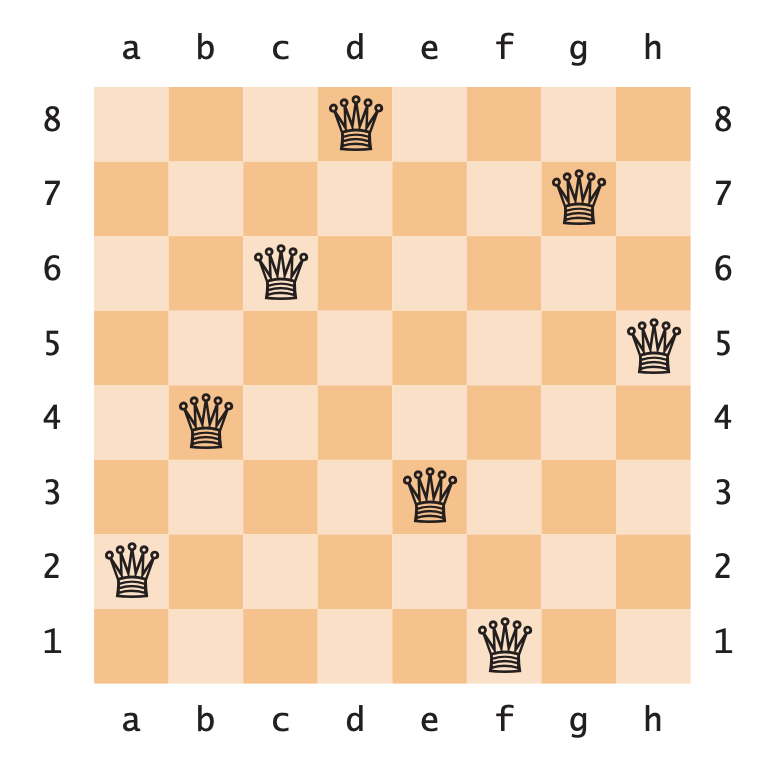
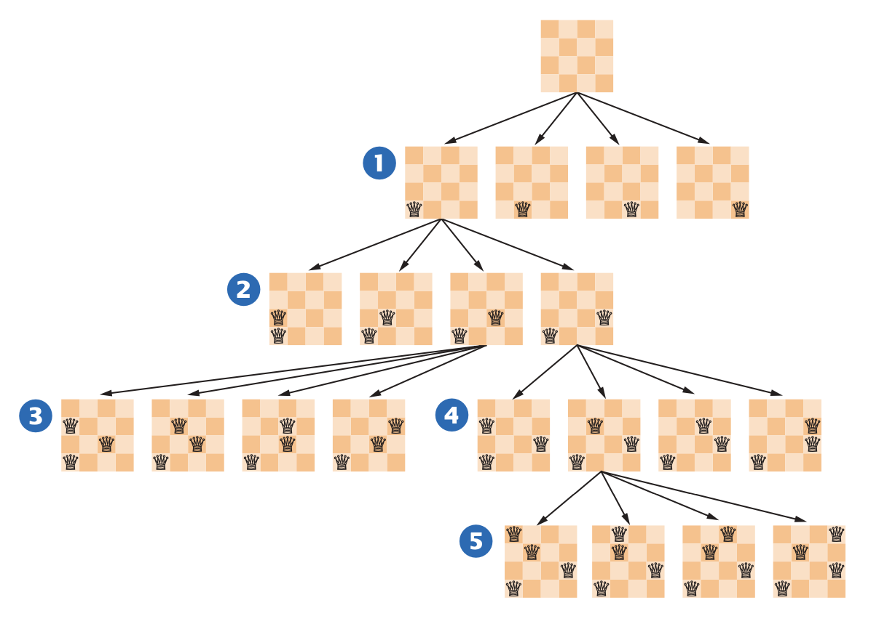

# Recursion

- Recursion is a powerful technique for breaking up complex computational problems into 
  simpler ones.
- The term “recursion” refers to the fact that the same computation occurs repeatedly.
- There are some computations that are very difficult to perform without recursion.
- Two conditions need to be fulfilled for a recursive function:
  - Every recursive call must simplify the computation in some way.
  - There must be special cases (sometimes called base cases) to handle the simplest 
    computations directly.

## Thinking recursively

- Let's test whether a sentence is a palindrome.
- A palindrome string is equal to itself when you reverse all characters. For ex:
  - A man, a plan, a canal—Panama!
  - Go hang a salami, I’m a lasagna hog
  - Madam, I’m Adam
- When testing for a palindrome, we ignore the difference between upper and lower case 
  letters, as well as spaces and punctuation marks.

### Step 1

- Consider various ways to simplify input.
  - To Simplify input in this example we may need to remove some characters from the 
    input.
  - Sometimes it is more useful to cut the input into half.
- Several possibilities of simplifying input.
  - Remove the first character.
  - Remove the last character.
  - Remove both the first and last characters.
  - Remove a character from the middle.
  - Cut the string into two halves.

### Step 2
- Combine solutions with simpler inputs into a solution to the original problem.
- We need to imagine that the solution to simpler input is available for this.
- We can turn the solution of the simpler input into a solution to the original input.
- Let's look at the definition of the problem palindrome.
  - A word is palindrome if first and last letters match.
  - The word obtained by removing the first and last letters is also a palindrome.
- Consider various solutions from above step.
  - Cut the string into two halves doesn't seem to be a good idea here.
  - Removing the first and last letters from a word seems to ideal for this.
- We need to look at constraints like inputs which contains empty strings, special 
  characters etc.
- Create the scenarios for various constraints on the input.  
  - If the first and last characters are both letters, then check whether they match. 
    If so, remove both and test the shorter string.
  - Otherwise, if the last character isn’t a letter, remove it and test the shorter string.
  - Otherwise, the first character isn’t a letter. Remove it and test the shorter string.

### Step 3

- Solution to simpler input
- The simplest strings for the palindrome test:
  - Strings with two characters -> We can follow step 2 for this.
  - Strings with a single character -> Single characters are already palindromes.
  - The empty string -> An empty string is also a palindrome.

### Step 4

- Implement solution by following simple case and the reduction step.
```
def isPalindrome(text) :
    length = len(text)
    
    # Separate case for shortest strings. 
    if length <= 1 :
        return True 
    else :
        # Get first and last characters, converted to lowercase. 
        first = text[0].lower()
        last = text[length - 1].lower()
        if first.isalpha() and last.isalpha() : 
            # Both are letters.
            if first == last :
                # Remove both first and last character. 
                shorter = text[1 : length - 1] 
                return isPalindrome(shorter)
            else :
                return False
        elif not last.isalpha() :
            # Remove last character. 
            shorter = text[0 : length - 1] return isPalindrome(shorter)
        else :
            # Remove first character. 
            shorter = text[1 : length] 
            return isPalindrome(shorter)
```

# Efficiency of recursion

- Consider the Fibonacci sequence: a sequence of numbers defined by the equation
```
f1 = 1
f2 = 1
fn = fn−1 + fn−2
```
- Each value of the sequence is the sum of the two preceding values. The first ten 
  terms of the sequence are `1, 1, 2, 3, 5, 8, 13, 21, 34, 55`.
- Here is the code:
```
def main() :
  n = int(input("Enter n: ")) 
  for i in range(1, n + 1) :
    f = fib(i)
    print("fib(%d) = %d" % (i, f))

def fib(n) :
  if n <= 2 : 
    return 1
  else :
    return fib(n - 1) + fib(n - 2)

main()

O/P:
Enter n: 50
fib(1) = 1
fib(2) = 1
fib(3) = 2
fib(4) = 3
fib(5) = 5
fib(6) = 8
fib(7) = 13
.. .
fib(50) = 12586269025        
```
- The first few calls to the fib function are fast, but for the larger values, the
  program pauses an amazingly long time between outputs.
- Below figure shows the pattern of recursive calls for computing fib(6). 
- The program is computing the same values over and over. For example, the computation
  of fib(6) calls fib(4) twice and fib(3) three times.



- Saving the previously calculated values results in improved performance.
```python
def fib(n) :
  if n <= 2 : 
    return 1
  else :
    olderValue = 1
    oldValue = 1
    newValue = 1
    for i in range(3, n + 1) :
      newValue = oldValue + olderValue 
      olderValue = oldValue
      oldValue = newValue
    return newValue
```

## Comparison between iteration vs recursion

- Frequently, the iterative and recursive solution have essentially the same performance. For ex, here 
  is an iterative solution for the palindrome test:
```python
def isPalindrome(text) : 
  start = 0
  end = len(text) - 1 
  while start < end :
    first = text[start].lower()
    last = text[end].lower()
    if first.isalpha() and last.isalpha() :
        # Both are letters. 
      if first == last :
        start = start + 1
        end = end - 1 
      else :
        return False
    if not last.isalpha() : 
      end = end - 1
    if not first.isalpha() : 
      start = start + 1
    return True
```
- If a palindrome has n characters, the iteration executes the loop between n / 2 and n times, depending on how many 
  of the characters are letters.
- The recursive solution also calls itself between n / 2 and n times, because one or two characters are removed 
  in each step.  
- In the above situation, the iterative solution tends to be a bit faster, because each recursive function call 
  takes a certain amount of processor time.
- It is possible for a smart compiler to avoid recursive function calls if they follow simple patterns, but 
  Python’s compiler does not do that.
- Conclusion:
  - Many problems have recursive solutions that are easier to understand and implement correctly than their iterative
    counterparts.
  - Sometimes there is no obvious iterative solution at all. For ex, permutations problem.

# Permutations

- Let's design a function that lists all permutations of a string.
- A permutation is simply a rearrangement of the letters in the string. 
- For example, the string "eat" has six permutations.
  - eat
  - eta
  - aet
  - ate
  - tea
  - tae
- Let's simplify the problem.
  - First we generate all permutations that start with `e`, then with `a` and finally with `t`.
  - To generate the permutations that start with `e`, we need to know permutations of `at`.
    - The permutations of `at` are `at` and `ta`.
    - For each permutation of `at` prepend `e`. We get `eat` and `eta`.
  - Repeat the same steps for `a` and `t`.

## Implementation

- In the permutations function, we loop through all positions in the word to be permuted.
- For each of them, we compute the shorter word that is obtained by removing the ith letter:
```
shorter = word[ : i] + word[i + 1 : ]
```
- Compute the permutations of the shorter word
```
shorterPermutations = permutations(shorter)
```
- Finally, add the removed letter to the front of all permutations of the shorter word.
```python  
for s in shorterPermutations : 
  result.append(word[i] + s)
```
- For the complete program look at the source code at `chapter11/permutations.py`.

# Back tracking

- In a backtracking algorithm, one explores all paths towards a solution. 
  When one path is a dead end, one needs to backtrack and try another choice.
- Backtracking contains following procedure.
  - A procedure to examine a partial solution and determine whether to
    - Accept it as an actual solution.
    - Abandon it (either because it violates some rules or because it is clear that it
   can never lead to a valid solution). 
    - Continue extending it.
  - A procedure to extend a partial solution, generating one or more solutions that 
    come closer to the goal.
```
Solve(partialSolution) 
  Examine(partialSolution). 
  If accepted
    Add partialSolution to the list of solutions. 
  Else if not abandoned
    For each p in extend(partialSolution) 
      Solve(p).
```

## Backtracking example

- Let's take an example of 8 queens on a chess board.
- The task of positioning eight queens on a chess board so that none of them attacks
  another according to the rules of chess.
  - There should be no two queens on the same row, column, or diagonal
      
    

- Procedure for solving the problem.
  - Examine a partial solution and determine whether to
    - Accept it as an actual solution.
    - Abandon it
      - Because it violates some rules or it can never lead to a valid solution
    - Continue extending it
  - Extend a partial solution, generating one or more solutions that come closer 
    to the goal.
- Here is the algorithm to describe the above procedure.
```
solve(partialSolution) 
  Examine(partialSolution). 
  if accepted
    Add partialSolution to the list of solutions. 
  else if not abandoned
    For each p in extend(partialSolution) 
      Solve(p).
```
- The processes of examining and extending a partial solution depend on the nature 
  of the problem.
- Examine  
  - For n(or 8) queens problems examining partial solution is to simply if two queens
    attack each other.
- Extend
  - Add another queen on an empty square.
- Partial solution
  - Represent a partial solution as a list of strings, where each string gives a 
    queen position in the traditional chess notation. For ex, `["a1", "e2", "h3", "f4"]`.

### Solve

- The solve function using the above algorithm can be written as:
```python
def solve(partialSolution) :
  exam = examine(partialSolution) 
  if exam == ACCEPT :
    print(partialSolution) 
  elif exam != ABANDON :
    for p in extend(partialSolution) : 
    solve(p)
```

### Examine

- The `examine` function checks whether two queens in a partial solution attack each other:
```python
COLUMNS = "abcdefgh"
NQUEENS = len(COLUMNS)
ACCEPT = 1
CONTINUE = 2
ABANDON = 3
def examine(partialSolution) :
    for i in range(0, len(partialSolution)) :
        for j in range(i + 1, len(partialSolution)) :
            if attacks(partialSolution[i], partialSolution[j]) :
                return ABANDON
            if len(partialSolution) == NQUEENS :
                return ACCEPT 
            else :
                return CONTINUE
```

### Extend
- The `extend` function takes a partial solution and makes eight copies of it. Each copy gets a new queen in a 
  different column.
```python
def extend(partialSolution) : 
    results = []
    row = len(partialSolution) + 1 
    for column in "abcdefgh" :
        newSolution = list(partialSolution) 
        newSolution.append(column + str(row)) 
        results.append(newSolution)
    return results
```

### Attack

- To determine when two queens attack each other diagonally. Here is an easy way of checking that. 
  - Compute the slope and check whether it is ±1.
  - All three lines represent same logic.
```
(row2 − row1)/(column2 − column1) = ±1 
                      row2 − row1 = ±(column2 − column1)
                   |row 2 − row1| = |column 2 − column1|
```
- Using the above logic the `attack` function can be written as:
```
def attacks(p1, p2) :
  column1 = COLUMNS.index(p1[0]) + 1 
  row1 = int(p1[1])
  column2 = COLUMNS.index(p2[0]) + 1 
  row2 = int(p2[1])
  return (row1 == row2 or column1 == column2 or abs(row1 - row2) == abs(column1 - column2))
```

## 4 Queens problem solution

- Below figure shows the solve function in action for a four queens problem.

