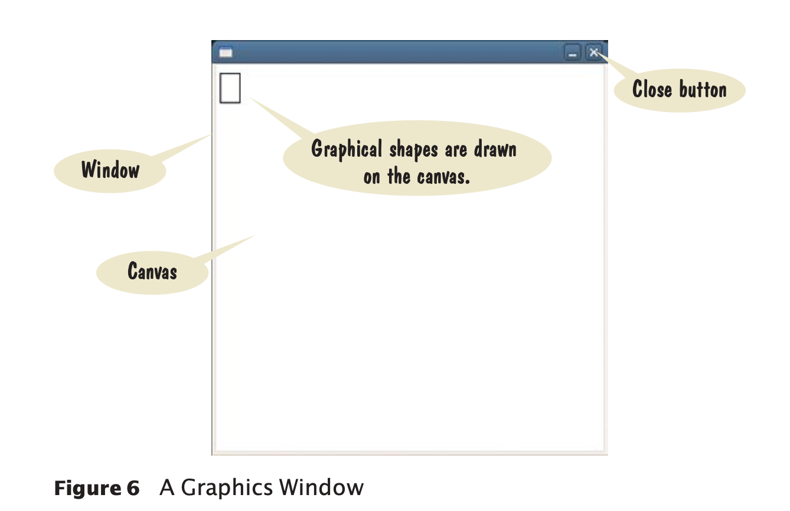
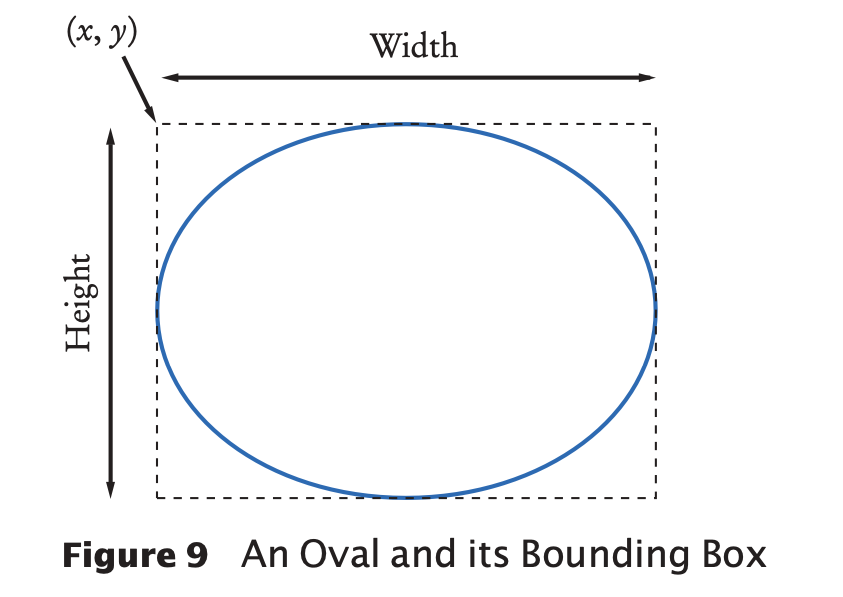
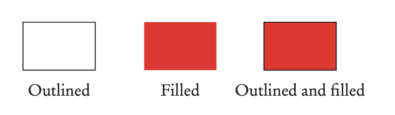

# Variables

- Variables are used to store values.
- variable is a storage location in a program.
  - It is similar to a parking space in a parking garage. The parking space has an identifier say "J041",
    and it can hold a vehicle. Similarly, a variable has a name and it can hold a value.

## Variable names

- When a variable is defined, it is better to give a name that explains its purpose. 
- Variable name in Python must follow a few simple rules:
  - Names must start with a letter or the underscore (_) character, 
    and the remaining characters must be letters, numbers, or underscores.
  - Names Cannot have other symbols such as ? or %. 
  - Spaces are not permitted inside names. 
  - Use uppercase letters to denote word boundaries, as in cansPerPack(camel case convention).  
  - names are case-sensitive.
  - Reserved words like if, else, switch etc cannot be used.

## Constants

- A constant variable, or simply a constant, is a variable whose value 
  should not be changed after it has been assigned an initial value.
- Some languages provide an explicit mechanism for marking a variable as a 
  constant and will generate a syntax error if you attempt to assign a 
  new value to the variable.
- Python leaves it to the programmer to make sure that constants are not changed.
- It is common practice specifying a constant variable with the use of all 
  capital letters for its name. For ex `BOTTLE_VOLUME = 2.0`.
  
## Variables program
- Let's take an example to illustrate variables.
  - Soft drinks are sold in cans and bottles. A store offers six-pack of 12-ounce(.355 litres)
    cans in for the same price as 2 litre bottles. which one should we buy?
    
```
# Liters in a 12-ounce can and a two-liter bottle. 
CAN_VOLUME = 0.355
BOTTLE_VOLUME = 2.0

# Number of cans per pack. 
cansPerPack = 6

# Calculate total volume in the cans.
totalVolume = cansPerPack * CAN_VOLUME
print("A six-pack of 12-ounce cans contains", totalVolume, "liters.")

# Calculate total volume in the cans and a 2-liter bottle.
totalVolume = totalVolume + BOTTLE_VOLUME
print("A six-pack and a two-liter bottle contain", totalVolume, "liters.")
```

- `cansPerPack = 6` the left-hand side of the assignment consists of a variable. 
  The right-hand side is an expression that has a value.
- After a variable has been defined, it can be used in other statements. 
  For example, `print(cansPerPack)`.
- If an existing variable is assigned a new value, that value replaces the previous 
  contents of the variable. For example, `cansPerPack = 8`.
- It is perfectly legal to write `cansPerPack = cansPerPack + 2`. It means to 
  look up the value stored in the variable cansPerPack, add 2 to it, 
  and place the result back into cansPerPack.

## Data types
  
- The data-type of a value determines how the data is represented in the computer and what operations can be performed on that data.
- A data type provided by the language itself is called a primitive data type.
- Python supports quite a few data types: numbers, text strings, files, containers, and many others.
- Programmers can also define their own user-defined data types.

### Number types  
- There are several types of numbers.
- An integer value is a whole number without a fractional part.
- A float value is a number with a fractional part, such as .355.
- A variable in Python can store a value of any type.
  - The data type is associated with the value, not the variable. For example, 
    consider this variable that is initialized with a value of type int:
    `taxRate = 5`.
  - The same variable can later hold a value of type float:
    `taxRate = 5.5`.  
  - It could even hold a string:
    `taxRate = "Non-taxable"` # Not recommended
- once a variable is initialized with a value of a particular type, 
  it's a good practice to keep the same type in that variable.    
  
# Arithmetic calculations

## Basic arithmetic operations

- Python supports four arithmetic operations as a calculator-addition(+),
  subtraction(-), multiplication(*) and division(/).
- The symbols + - * / for the arithmetic operations are called operators. 
- The combination of variables, literals, operators, and parentheses is called 
  an expression. For ex, `(a + b) / 2` is an expression.
- Parentheses are used just as in algebra: to indicate in which order 
  the parts of the expression should be computed. 
- As in algebra, operators with the same precedence are executed left-to-right.
  For ex, `10 - 2 - 3 is 8 – 3 or 5`.

## Powers

- Python uses the exponential operator ** to denote the power operation. For ex,
  the expression a<sup>2</sup> is a ** 2.
- The exponential operator has a higher order of precedence than the other 
  arithmetic operators.
- Unlike the other arithmetic operators, power operators are evaluated 
  from right to left. For ex, expression 10 ** 2 ** 3 is equivalent to 
  10<sup>(2<sup>3</sup>)</sup> = 10<sup>8</sup>.
- In Python, you have to write all expressions in a linear arrangement. 
  For example, the mathematical expression b×(1+ r/100)<sup>n</sup> becomes
  b * (1 + r/100) ** n.

## Floor division and remainder

- In python, when two integers are divided with the / operator, a floating-point 
  value is returned. For example, 7/ 4 yields 1.75.
- The floor division in python 7 // 4 returns 1 by discarding the fraction 0.75.
- The expression  7 % 4 returns the remainder 3. This operator `%` is also called
  `modulo` or simply `mod`.

## Built-in functions

- To return absolute value use abs() function. For ex, abs(-173) returns 173.
- The function round(7.625) returns 8, whereas round(7.625, 2) returns 7.63.
- There are built-in mathematical functions like max(x1,x2, ..., xn), 
  min(x1,x2, ...,xn)
  
## Mathematical functions

- Python contains a standard library that can be used to create powerful programs.
- A library is a collection of code that has been written and translated which
  is ready to use in the programs.
- Python's standard library is organized into modules.
- Related functions and data types are grouped into the same module.
- Functions defined in a module must be explicitly loaded into your program before they can be used.
- Python’s math module includes a number of mathematical functions.
- To use any function from this module, it must be imported. For ex, to use
  sqrt() function,
```
from math import sqrt
y = sqrt(x)
```  
- Here is a list of important math functions

```
sqrt(x)     - The square root of x. (x ≥ 0)
trunc(x)    - Truncates floating-point value x to an integer.
cos(x)      - The cosine of x in radians. similary sin and tan also available.
exp(x)      - e^x
degrees(x)  - Convert x radians to degrees (i.e., returns x · 180/π)
radians(x)  - Convert x degrees to radians (i.e., returns x · π /180)
log(x)      - The natural logarithm of x (to base e)
log(x, base)- The logarithm of x to the given base.

```

## Round-off errors

- If 1/3 is calculated to two decimal places, it returns 0.33. Multiplying
  0.33 by 3 returns 0.99, not 1.00.
- Processor hardware uses binary number system using digits 0 and 1. Similar to 
  decimal system round off errors may occur when binary digits are lost. For ex,
```
price = 4.35
quantity = 100
total = price * quantity # Should be 100 * 4.35 = 435 
print(total) # Prints 434.99999999999994
```  
- Round-off errors can be dealt by rounding to the nearest integer or 
  by displaying a fixed number of digits after the decimal separator. 

## Other Ways to Import Modules

- `from math import sqrt, sin, cos` to import multiple functions.
- `from math import *` to import all functions.
- `import math` simplest of all, but to invoke use module name as in `math.sqrt(x)`.

## Line joining

- If an expression is too long to fit on a single line, it can be continued to
  another line provided the line break occurs inside parenthesis. For ex,
```
x1 = ((-b + sqrt(b ** 2 - 4 * a * c)) 
/ (2 * a)) # Ok
```
- If the last character of a line is a backslash, the line is joined with 
  the one following it:
```
x1 = (-b + sqrt(b ** 2 - 4 * a * c)) \ 
/ (2 * a) # Ok

```

# Strings

- String literals are specified by enclosing a sequence of characters 
  within a matching pair of either single or double quotes. 
  For ex, `greeting = "Hello"`.
- By allowing both types of delimiters, Python makes it easy to 
  include an apostrophe or quotation mark within a string. For ex,
  `message = 'He said "Hello"'` or `message = "It's my book"`
- To compute the length of a string use len function: 
  `length = len("World!") # length is 6`.

## Concatenation and Repetition

- Two strings can be concatenated using the operator `+`.
```
firstName = "Harry" lastName = "Morgan"
name = firstName + lastName
o/p: "HarryMorgan"

If space is required
name = firstName + " " + lastName
o/p: "Harry Morgan"
```
- The expressions on both left and right side of the operator `+` should
  be strings, otherwise syntax error will occur.
- A string of any length can be repeated using the `*` operator. 
  
```
message = "Echo..." 
print(message * 5)

dashes = "-" * 50
print(dashes)

o/p: 
Echo...Echo...Echo...Echo...Echo...
-------------------------------------------------
```

## Converting Between Numbers and Strings

- String and number cannot be concatenated directly. For ex,
  `name = "Agent " + 1729` produces syntax error.
- To produce the string representation of a number use `str()` function.
  For ex, `str(1729)`.
- To use number with string
```
id = 1729
name = "Agent " + str(id)
```
- To convert string into a number use the int and float functions.
```
id = int("1729")
price = float("17.29")
```
- Blank spaces at the front or back will be ignored: 
  int(" 1729 ") is still 1729.

## Strings and Characters

- Strings are sequences of Unicode characters.
- individual characters of a string can be accessed based on their 
  position(index) within the string.
- The first character has index 0, the second has index 1, and so on.
- For example, if the variable name is defined as `name = "Harry"`, then
  `first = name[0]` and `last = name[4]`.
- The len function can be used to determine the position of the last index.
```
pos = len(name) - 1 # Length of "Harry" is 5 
last = name[pos] # last is set to "y"
```
## String Methods

- A method can only be applied to an object of the type for which 
  it was defined.
- Some useful string methods are lower, upper, replace(old,new).
```
name = "John Smith"

uppercaseName = name.upper()  # Sets uppercaseName to "JOHN SMITH"

print(name.lower()) # Prints john smith

name2 = name.replace("John", "Jane") # Sets name2 to "Jane Smith"
```
- None of the methods change the contents of the original string name.
  After the call name.upper(), the name variable still holds "John Smith".

## Character values

- A character is stored internally as an integer value. 
- Python provides two functions related to character encodings.
  - The ord function returns the number used to represent a given character.
  - The chr function returns the character associated with a given code. 
```
print("The letter H has a code of", ord("H")) 
print("Code 97 represents the character", chr(97))

O/P:
The letter H has a code of 72
Code 97 represents the character a
```

## Escape sequences

- When both single quote and double quotes are required in a statement,
  precede the quotation marks with a backslash (\). For ex,
  `"You're \"Welcome\""`.
- To include a backslash in a string, use the escape sequence \\. For ex,
  `"C:\\Temp\\Secret.txt"`.
- Another common escape sequence is \n, which denotes a newline character.
```
print("*\n**\n***")

O/P: prints characters on 3 seperate lines.

* 
** 
***
```

## Input and Output

- In Python, displaying a prompt and reading the keyboard input is 
  combined in one operation. For ex `first = input("Enter your first name: ")`.
- The input function can only obtain a string of text from the user.
- To read an integer/float value, first use the input function to obtain the data as a
  string and convert it into an integer/float using int/float functions. For ex,
```
userInput = input("Please enter the number of bottles: ")
bottles = int(userInput)

userInput = input("Enter price per bottle: ") 
price = float(userInput)  
```

## Formatted Output

- When result of a computation is printed, it is often formatted. For ex,
  `Price per litre : 1.22` instead of `Price per litre : 1.215962441314554`.
- To print a value with two digits after decimal point `print("%.2f" % price)`.
- To specify field width `print("%10.2f" % price)`. This has total length of 
  10 characters including spaces, decimal point and characters after decimal point.
- In `%10.2f` the price is right justified using 10 characters.
- `%` symbol denotes remainder operator if both operands are numbers, otherwise it
  represents string format operator.
- To format multiple values they must be enclosed in parentheses and separated 
  by commas. For ex, `print("Quantity: %d Total: %10.2f" % (quantity, total))`.
- When a field width is specified, the values are right justified.
```
title1 = "Quantity:"
title2 = "Price:"
print("%10s %10d" % (title1, 24)) 
print("%10s %10.2f" % (title2, 17.29))

result in the following output:
  Quantity:        24 
     Price:     17.29
```
- To specify left justification add minus sign before the field width.
```
print("%-10s %10d" % (title1, 24)) 
print("%-10s %10.2f" % (title2, 17.29))
```
## Graphics: Sample Drawings

- We use simplified version of Python’s more complex library module called
  ezgraphics.
- This is used for simple drawings such as figures, graphs, or charts in the programs.

## Creating a Window

- A graphical application shows information inside a window on the desktop 
  with a rectangular area and a title bar.
  
- To create a graphics window: `win = GraphicsWindow()` or `win = GraphicsWindow(width, height)`.
  For ex `win = GraphicsWindow()`. Default window without arguments contains canvas 
  that 400 pixel wide and 400 pixel tall.
- To access the canvas inside the window `canvas = win.canvas()`.
- To create a rectangle `canvas.drawRect(x, y, width, height)`. For ex, 
  `canvas.drawRect(15, 10, 20, 30)`.
- To wait for the user to close the window `win.wait()`.

## Lines and Polygons, Ovals, Circles and Text

- To draw a line `canvas.drawLine(x1, y1, x2, y2)`. For ex, `canvas.drawLine(100, 100, 200, 100)`.
- The origin (x, y) at (0,0) is at the upper left corner.
- To draw an oval specify a bounding box in the same way as a rectangle. To draw 
  an oval use the method call like `canvas.drawOval(x, y, width, height)`.
    
- To draw text `canvas.drawText(50, 100, "Message")`.  

## Filled shapes and color

- The geometric shapes can be drawn in one of three styles––outlined, filled, or out- lined and filled.
- The style used to draw a specific shape depends on the current fill color and outline color as set in the canvas.
  
- To draw a rectangle 
```
canvas.setOutline(255, 0, 0) 
canvas.drawRect(10, 20, 100, 50)
```

## Sympify library

- Use Ipython console in Sypder IDE or create a py file for built-in support
  for sympify.
- To import `from sympy import *`.
- Symbolic expression using sympify `f = sympify("x ** 2 * sin(x)")`. printf will
  return `x**2*sin(x)` without spaces.
- `sympify(x * x ** 2)` returns `x**3`.
- Alternatively, define a symbolic expression and store it in a variable. It is 
  convenient to name that variable also x. For ex,
```
x = sympify("x")
f = x ** 2 * sin(x)
print(f) # yields x**2*sin(x)
```  
- To draw the graph use plot function. For ex, `plot(f)`.
- To expand the expression use expand function. For ex,
```
f2 = expand((x - 1) * (x + 1))
f3 = expand((x - 1) ** 5)

print(f2) # yields x**2 - 1
print(f3) # yields x5 – 5x4 + 10x3 – 10x2 + 5x –1
```

- To find the solution of an expression use solve function.
```
f4 = solve(x**2 + 2 * x - 8)
f5 = solve(sin(x) - cos(x))

print(f4) # yields [-4, 2]
print(f5) # yields [pi/4]

```
- To find the differentiation(dy/dx) and integration of an expression use
  diff and integrate functions.
```
x = sympify("x")
f = x ** 2 * sin(x)  

print(diff(f)) # Yields x2 cos(x) + 2x sin(x)

print(integrate(f)) # yields –x2 cos(x) + 2x sin(x) + 2 cos(x)
```
- To substitue a value in an expression and evaluate
  `result = integrate(f).subs(x, 0).evalf()`. Result is 2.0

- calling plot by default gives a plot with default range of x from -10 to 10. 
  For custom range `plot(f, (x, -20, 20))`.    
