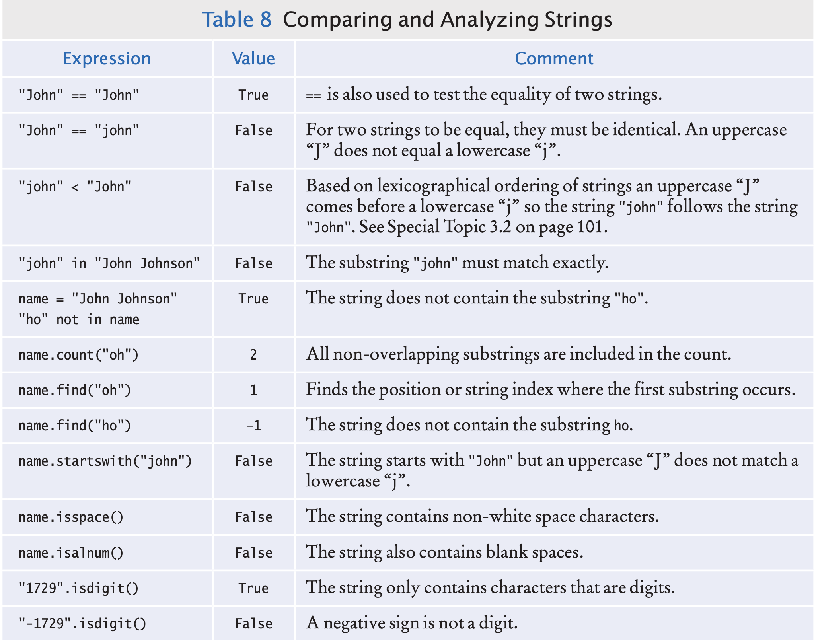

# Decisions

- Decision-making is very useful for a program to take different actions based on input.
- In python decisions can be taken using `if-else` statements.

## The `if` statement

- An if statement is like a fork in the road. Depending upon a decision, 
  different parts of the program are executed.
- The syntax for if statement is
  ```
  if condition : 
    statements
  ```
- The syntax for if-else statement is  
  ```
  if condition : 
    statements
  else : 
    statements
  ```
- Consider an example to explain `if`. In many countries the number 13 
  is considered unlucky. In the elevator `13` is not shown. It is skipped and called
  floor 14. All floors above 13 have 1 number higher. Let's write a program to decrement
  the number when the input is above 13.

```
floor = int(input("Floor: "))
# Adjust floor if necessary.
if floor > 13 :
    actualFloor = floor - 1
else :
    actualFloor = floor
# Print the result.
print("The elevator will travel to the actual floor", actualFloor)
```  

## Compound statements

- The `:` at the end of an `if` or `else` represents a compound statement.
- Some constructs in Python are compound statements, which span multiple lines
  and consist of a header and a statement block.  
- The if statement is an example of a compound statement. For ex,
```
if totalSales > 100.0 : # The header ends in a colon.
    discount = totalSales * 0.05 # Lines in the block are indented to the same level 
    totalSales = totalSales - discount
    print("You received a discount of", discount)
```
### Conditional expression

- Python has a conditional operator of the form `value1 if condition else value2`.
- The value of that expression is either value1 if the condition is true 
  or value2 if it is false.
- For ex `actualFloor = floor - 1 if floor > 13 else floor`.
- We can use a conditional expression anywhere that a value is expected, 
  for example: `print("Actual floor:", floor − 1 if floor > 13 else floor)`.

# Relational operators

- In most of the cases, the if condition involves comparing two values. In the 
  previous example, we have used `floor > 13`. The symbol `>` is a relational operator.
- Few important relational operators.
```
Python  Math-Notation    Description
>       >                Greater than
>=      ≥                Greater than or equal
<       <                Less than
<=      ≤                Less than or equal
==      =                Equal
!=      ≠                Not equal
```
- In python `=` denotes assignment, for equality comparison use `==`.
- Logical expressions can be also be used for comparison. For ex, 
```
x * x == y :
x * x < y :
abs(x * x) < y :
```

# Comparing floating-point numbers

- Floating-point numbers have only a limited precision, and calculations can
  introduce round-off errors. For example,
```
r = sqrt(2.0)
if r * r == 2.0 :
    print("sqrt(2.0) squared is 2.0")
else :
    print("sqrt(2.0) squared is not 2.0 but", r * r)

O/p: sqrt(2.0) squared is not 2.0 but 2.0000000000000004    
```
- It does not make sense in most circumstances to compare floating-point numbers 
  exactly. we should test whether they are close enough.
- Typically, the closeness is compared with a small value like epsilon(ε).
- It is common to set ε to 10<sup>–14</sup> when comparing floating-point numbers.
```
from math import sqrt

EPSILON = 1E-14
r = sqrt(2.0)
if abs(r * r - 2.0) < EPSILON :
    print("sqrt(2.0) squared is approximately 2.0")
```
## Lexicographical ordering of Strings

- The ordering of strings is lexicographical, which is very similar to a dictionary.
- If two strings string1 and string2 have a relation `string1 < string2` returns
  true, if string1 comes first in dictionary order.
- There are few differences between dictionary and python's lexicographical order.
  - All uppercase letters come before the lowercase letters. For example, "Z" comes before "a".
  - The space character comes before all printable characters.
  - Numbers come before letters.
  
## Nested Branches

- It is often necessary to include an if statement inside another. A typical use case
  is taxation. Such an arrangement is called nested set of statements.
- For example, there are different tax rates based on income and also different tax rates
  based on marital status.
- The two level decision process is reflected in two levels of if statements in the program.

```
# Initialize constant variables for the tax rates and rate limits. 
RATE1 = 0.10
RATE2 = 0.25
RATE1_SINGLE_LIMIT = 32000.0
RATE1_MARRIED_LIMIT = 64000.0

# Read income and marital status.
income = float(input("Please enter your income: "))
maritalStatus = input("Please enter s for single, m for married: ")

# Compute taxes due. 
tax1 = 0.0
tax2 = 0.0

if maritalStatus == "s" :
  if income <= RATE1_SINGLE_LIMIT :
    tax1 = RATE1 * income 
  else :
    tax1 = RATE1 * RATE1_SINGLE_LIMIT
    tax2 = RATE2 * (income - RATE1_SINGLE_LIMIT) 
else :
  if income <= RATE1_MARRIED_LIMIT : 
    tax1 = RATE1 * income
  else :
    tax1 = RATE1 * RATE1_MARRIED_LIMIT
    tax2 = RATE2 * (income - RATE1_MARRIED_LIMIT)
    
totalTax = tax1 + tax2

# Print the results.
print("The tax is $%.2f" % totalTax)
```

## Multiple alternatives

- In many situations there are more than two cases to implement a decision.
- For example, consider a program that displays the effect of an earthquake, 
  as measured by the Richter scale.
  - 8   > Most structures fall
  - 7   > Many buildings destroyed
  - 6   > Many buildings considerably damaged, some collapse
  - 4.5 > Damage to poorly constructed buildings  
- The program implementation for this looks like this.
```
if richter >= 8.0 :
  print("Most structures fall")
else :
  if richter >= 7.0 :
    print("Many buildings destroyed") 
  else :
    if richter >= 6.0 :
      print("Many buildings considerably damaged, some collapse")
    else :
      if richter >= 4.5 :
        print("Damage to poorly constructed buildings") 
      else :
        print("No destruction of buildings")
```
- The code in the above program shifts to the right due to indentation. Python
  provides an alternative `elif` for creating if statements containing multple alternatives.
```
if richter >= 8.0 :
  print("Most structures fall")
elif richter >= 7.0 :
  print("Many buildings destroyed")
elif richter >= 6.0 :
  print("Many buildings considerably damaged, some collapse")
elif richter >= 4.5 :
  print("Damage to poorly constructed buildings")
else :
  print("No destruction of buildings")
```  
- Don't reverse the order of `if` statements. For ex, if `richter >=4.5` is tested
  first, then it matches all conditions above 4.5. Specific matches won't execute at
  all.
- Simple `if` conditions can be written without `else or elif`. Then multiple if statements may
  match. For ex, if value is `8.1` then all if conditions match.

## Boolean Variables

- Boolean variables are named after the mathematician George Boole (1815–1864).
- The `bool` data type has exactly two values, denoted False and True.
- These values are not strings or integers, they are special values.

## Boolean operators  
- An operator that combines boolean conditions is called boolean operator.
- There are two common operators: 
  - `and` yields true when both conditions are true.
  - `or` yields true when on of the conditions is true.
- To test if water is liquid,
```
if temp > 0 and temp < 100: 
  print("Liquid")
```
- To invert the condition use `not` operator. For ex
```
if not frozen: 
  print("Not frozen")
```
- The `and` operator has higher precedence than the `or` operator.

### Chaining relational operators

- As in mathematics, python also combine multiple relational operators to compare
  a variable against multiple values as in `0 <= value <= 100`.
- Python interpreter automatically inserts the boolean operator `and` to form two 
  separate relational expressions like `value >= 0 and value <= 100`.
- Most programming languages do not allow multiple relational operators to be 
  combined in this fashion.

### Short-circuit evaluation

- The `and` and `or` operators are computed using short-circuit evaluation.
- It means, logical expressions are evaluated from left to right, 
  and evaluation stops as soon as the truth value is determined. 
  When an `and` is evaluated and the first condition is false, 
  the second condition is not evaluated. For ex,
  `quantity != 0 and price / quantity < 10`.
- Suppose the value of quantity is zero. Then the test quantity != 0 fails, 
  and the second test is not attempted.

### De Morgan’s Law

- De Morgan’s Law has two forms: one for the negation of an `and` expression and 
  one for the negation of an `or` expression:
```
not (A and B) is the same as not A or not B 
not (A or B) is the same as not A and not B
```  
- For example, the negation of “the state is Alaska or it is Hawaii”,
```  
    not (state == "AK" or state == "HI")
```    
  is “the state is not Alaska and it is not Hawaii”: 
```    
state != "AK" and state != "HI"
```

## Analyzing Strings

- There are various operations available to work with substrings.
```
Operation                 Description
substring in s            Returns True if the string s contains substring and False otherwise.
s.count(substring)        Returns the number of non-overlapping occurrences of substring in the string s.
s.endswith(substring)     Returns True if the string s ends with the substring and False otherwise.
s.find(substring)         Returns the lowest index in the string s where substring begins, or –1 if substring is not found.
s.startswith(substring)   Returns True if the string s begins with substring and False otherwise.
```
- Here are the examples:
```
if "-" not in name:
  print("The name does not contain a hyphen.")

if filename.endswith(".html"):
  print("This is an HTML file.")

line = "Four score and seven years ago" 
if line.islower() :
  print("The string contains only lowercase letters.") 
else :
  print("The string also contains uppercase letters.")  

if line.isalpha() :
  print("The string is valid.")
else :
  print("The string must contain only upper and lowercase letters.")  
```

## Methods for testing string characteristics

- s.isalnum() > Returns True if string s consists of only letters or digits and it contains at least one character. 
- s.isalpha() > Returns True if string s consists of only letters and contains at least one character.
- s.isdigit() > Returns True if string s consists of only digits and contains at least one character.
- s.islower()/s.isupper() > Returns True if string s contains at least one letter and all letters in the string are lowercase/uppercase.
- s.isspace() > Returns True if string s consists of only white space characters (blank, newline, tab) and it contains at least one character.

## List of methods for working with strings



## Terminating a program

- The exit function defined in the sys standard library module immediately aborts the program when executed.

```
from sys import exit
if not (userResponse == "n" or userResponse == "y"): 
  exit("Error: you must enter either n or y.")
```
## Sending an email

- Sample code for sending an email

```
from email.mime.multipart import MIMEMultipart 
from email.mime.text import MIMEText
from email.mime.image import MIMEImage
from email.mime.application import MIMEApplication

msg = MIMEMultipart()

msg.add_header("From", sender) 
msg.add_header("To", recipient1) 
msg.add_header("To", recipient2)

msg.add_header("Cc", recipient3) 
msg.add_header("Bcc", recipient4)

msg.add_header("Subject", subjectLine)
# To include plain body text
msg.attach(MIMEText(body, "plain"))
# To include html body
msg.attach(MIMEText(htmlBody, "html"))

# To attach an image/file
file = open("myimage.jpg", "rb") 
img = MIMEImage(file.read()) 
file.close()
msg.attach(img)

# For other attachments, such as PDF files or spreadsheets create a MIMEApplication
fp = open("/somedir/myfile.pdf", "rb") 
attachment = MIMEApplication(fp.read()) 
fp.close() 
attachment.add_header("Content-Disposition",
  "attachment; filename=myfile.pdf") // The file name without directory 
msg.attach(attachment)

# Sending a message
import smtplib
host = "smtp.gmail.com"
port = 587
server = smtplib.SMTP(host, port)

# Turn on secure communication
server.starttls()
server.login(username, password)
server.send_message(msg) 
server.quit()
```

