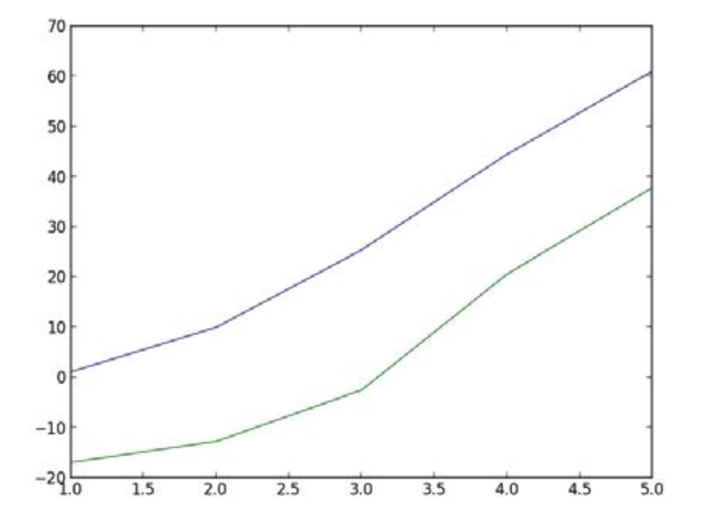

# Interactive graphical programs

- To make graphical windows interactive take user input before the call to wait() method.
- For ex,
```
from ezgraphics import GraphicsWindow
from sys import exit
win = GraphicsWindow()
canvas = win.canvas()
x = int(input("Please enter the x coordinate: "))
y = int(input("Please enter the y coordinate: "))
if x < 0 or y < 0:
    exit("Error: x and y must be >= 0")
canvas.drawOval(x - 5, y - 5, 10, 10)
win.wait()
```
- The `x` and `y` co-ordinates can be read from the point where mouse is clicked.
```
point = win.getMouse()
x = point[0]
y = point[1]
canvas.drawRectangle(x, y, 40, 50)
```

# Intersecting circles

- Develop a graphics program that draws two circles, each defined by its center and radius, and determines whether the two circles intersect.
- The result of the program can be one of the following.
  - The circles are completely separate. 
  - One circle is contained within the other. 
  - The circles intersect at a single point.
  - The circles are coincident.
  - The circles intersect at two points.
- Mathematical formula to determine if two circles intersect each other is 
  `d = sqrt((x1−x0)2+(y1−y0)2)` and compare it with the radius of the two 
  circles as follows:
  - If d > r0 + r1, the two circles do not intersect and are completely separate.
  - If d < |r0 − r1|, the two circles do not intersect and one is contained within the other.
  - If d = r0 + r1, the two circles intersect at a single point.
  - If d = 0 and r0 = r1, the two circles are coincident.
  - Otherwise, the two circles intersect at two points.

```
##
# Draws and determines if two circles intersect. The parameters of both
# circles are obtained from the user.
#

from ezgraphics import GraphicsWindow
from math import sqrt
from sys import exit

# Define constant variables.
MIN_RADIUS = 5
WIN_WIDTH = 500
WIN_HEIGHT = 500

# Create the graphics window and get the canvas.
win = GraphicsWindow(WIN_WIDTH, WIN_HEIGHT)
canvas = win.canvas()

# Obtain the parameters of the first circle.
print("Enter parameters for the first circle:")
x0 = int(input(" x-coord: "))
y0 = int(input(" y-coord: "))
if x0 < 0 or x0 >= WIN_WIDTH or y0 < 0 or y0 >= WIN_HEIGHT:
    exit("Error: the center of the circle must be within the area of the window.")

r0 = int(input(" radius: "))
if r0 <= MIN_RADIUS:
    exit("Error: the radius must be >", MIN_RADIUS)

# Draw the first circle.
canvas.setOutline("blue")
canvas.drawOval(x0 - r0, y0 - r0, 2 * r0, 2 * r0)

# Obtain the parameters of the second circle.
print("Enter parameters for the second circle:")
x1 = int(input(" x-coord: "))
y1 = int(input(" y-coord: "))
if x1 < 0 or x1 >= WIN_WIDTH or y1 < 0 or y1 >= WIN_HEIGHT:
    exit("Error: the center of the circle must be within the area of the window.")
r1 = int(input(" radius: "))
if r1 <= MIN_RADIUS:
    exit("Error: the radius must be >", MIN_RADIUS)


# Draw the second circle.
canvas.setOutline("red")
canvas.drawOval(x1 - r1, y1 - r1, 2 * r1, 2 * r1)

# Determine if the two circles intersect and select appropriate message.
dist = sqrt((x1 - x0) ** 2 + (y1 - y0) ** 2)

if dist > r0 + r1:
    message = "The circles are completely separate."
elif dist < abs(r0 - r1):
    message = "One circle is contained within the other."
elif dist == r0 + r1:
    message = "The circles intersect at a single point."
elif dist == 0 and r0 == r1:
    message = "The circles are coincident."
else:
    message = "The circles intersect at two points."

# Display the result at the bottom of the graphics window. canvas.setOutline("black")
canvas.drawText(15, WIN_HEIGHT - 15, message)
canvas.drawText(15, WIN_HEIGHT - 15, message)

# Wait until the user closes the window.
win.wait()

```

## Plotting simple graphs

- A graph provides a visual representation of data by showing the relationship between sets of numbers.
- The matplotlib module provides a collection of easy to use tools for creating many types of graphs.
- Here a simple program to display graph with temperatures.
```
from matplotlib import pyplot

# Plot data on the graph.
pyplot.bar(1, 1.1)
pyplot.bar(2, 10.0)
pyplot.bar(3, 25.4)
pyplot.bar(4, 44.5)
pyplot.bar(5, 61.0)

# Add descriptive information.
pyplot.xlabel("Month")
pyplot.ylabel("Temperature")


# Display the graph.
pyplot.show()
```

### Creating a line graph

- A line graph connects data points with line segments. 
- pass the lists of the x and y coordinates to the plot function as in 
  `pyplot.plot([1, 2, 3, 4, 5], [1.1, 10.0, 25.4, 44.5, 61.0])`.
- multiple lines can be plotted on the same graph.
```
pyplot.plot([1, 2, 3, 4, 5], [1.1, 10.0, 25.4, 44.5, 61.0]) # Highs
pyplot.plot([1, 2, 3, 4, 5], [-16.9, -12.7, -2.5, 20.6, 37.8]) # Lows
```



- The color of the line and the format can be customized. For ex,
```
pyplot.plot([1, 2, 3, 4, 5], [1.1, 10.0, 25.4, 44.5, 61.0], "r--o")
```
- `r` represents color. 
- `--` represent line style.  
- `o` represents marker styles.
  
  
- Here are the list of other color codes, line styles and marker styles.
```  
Color codes   Line styles                       Marker styles
-----------   -----------                       -------------
b Blue        `-`  Solid                        .   Point marker
g Green       `--` Dashed                       o   Circle marker
r Red         `:` Dotted                        v   Triangle down marker
c Cyan        `.` Alternating dashes and dots   ^   Traingle up marker
m Magenta                                       S   Square marker
y Yellow                                        *   Start marker
k Black                                         D   Diamond marker
w White
```
- To show a grid, call `pyplot.grid("on")`.
  
  

- The matplotlib automatically chooses limits for the x and y axes that include all data points.
- To change padding or range use xlim and ylim functions. For ex, 
```
pyplot.xlim(0.5, 5.5) 
pyplot.ylim(-40, 100)
```


!