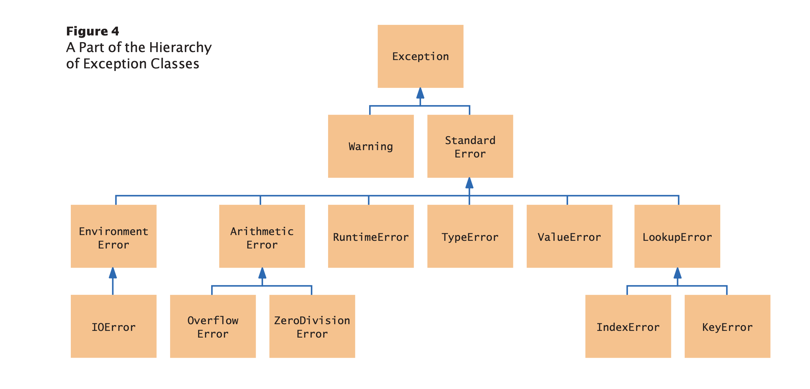

# Exception handling

- Exception handling provides a flexible mechanism for passing control from the point of
  error detection to a handler that can deal with the error.
  
## Raising exceptions

- The Python library provides a number of standard exceptions to signal all sorts 
  of exceptional conditions.
  

- Let's take an example: if amount > balance, what exception should raise?
  - Arithmetic Error > Python can deal with negative numbers. so not an option.
  - The correct error for this scenario is ValueError.
````
if amount > balance :
  raise ValueError("Amount exceeds balance")
````  

### Handling exceptions

- In python exceptions are handled with the try/except statement.
- The try block contains one or more statements that may cause an exception of the 
  kind that you are willing to handle. Here is an example.
````
try :
  filename = input("Enter filename: ") 
  infile = open(filename, "r")
  line = infile.readline()
  value = int(line)
  ....

except IOError :
  print("Error: file not found.")
  
except ValueError as exception : 
  print("Error:", str(exception))  
````
- The open function can raise an IOError exception
- The int function can raise a ValueError exception if the string contains non int value.

### The finally Clause

- The finally construct is used to handle the situation where we need to take an action
  whether or not an exception is raised. For ex, closing a file.
````
outfile = open(filename, "w") 
try :
  writeData(outfile)
finally : 
  outfile.close()
````  

### Do Not Use except and finally in the Same try Statement

- It is tempting to combine except and finally clauses, but the resulting code can be
  hard to understand, and it is often incorrect. Instead, use two statements:
  - a try/finally statement to close resources
  - a separate try/except statement to handle errors
````
try :
  outfile = open(filename, "w") 
  try :
    Write output to outfile. 
  finally :
    outfile.close() 

except IOError :
  Handle exception.
````

### The with Statement

- Because a try/finally statement for opening and closing files is so common, 
  Python has a special shortcut, which closes the file at the end of the statement
  or an exception is raised.
````
with open(filename, "w") as outfile : 
  Write output to outfile.
````
