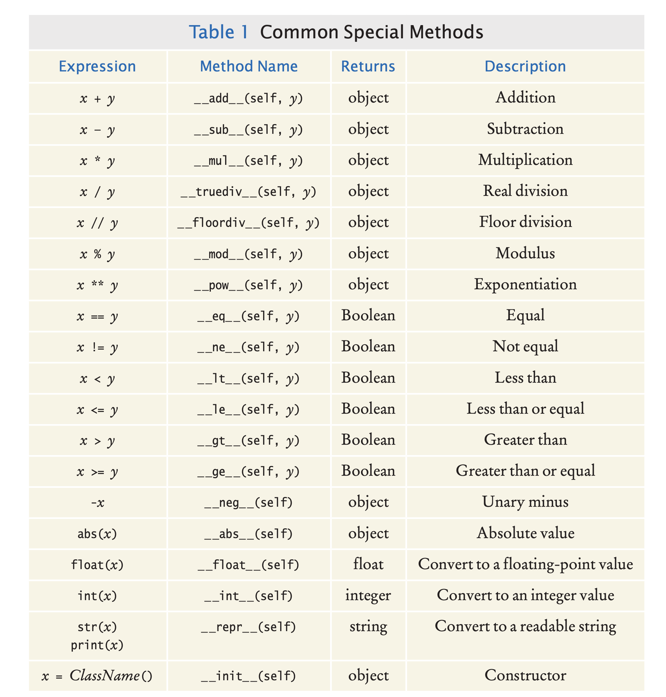

# Object-Oriented Programming(oops)

- It is difficult to understand and update a program that consists of a large collection of functions.
- To overcome this problem, computer scientists invented object-oriented programming.
- It is a programming style in which tasks are solved by collaborating objects.
- In oops, each object has its own set of data, together with a set of methods that act
  upon the data.
- We have seen this programming style when you used strings, lists, and file objects.

## Class

- In Python, a class describes a set of objects with the same behavior.
  - For example, the str class describes the behavior of all strings.
  - Similarly, the list class describes the behavior of objects that can be used to 
    store a collection of values.  
- Each class defines a specific set of methods that you can use with its objects.
  - For example, "Hello, World".upper()
- The set of all methods provided by a class, together with a description of their
  behavior, is called the public interface of the class.

## Encapsulation  
- When working with objects of a class we need to know the public interface of the 
  class. It is not required to know how the class is implemented or how the data is
  stored.
- The process of providing a public interface, while hiding the implementation details, 
  is called encapsulation.

### Advantages of encapsulation  
- When the implementation is hidden, the improvements do not affect the programmers 
  who use the objects.

## Implementing a class

- Let us write a class that models a tally counter, a mechanical device that is used 
  to count people for example, to find out how many people attend a concert or board
  a bus.
  - Whenever the operator pushes a button, the counter value advances by one. Let's
    name this `click`.
  - A physical counter has a display to show the current value. Let's name this `getValue`.
  - We reset the counter to 0 by invoking the reset method.
 ````
# Counter is the name of the class 
tally = Counter()
tally.reset()
tally.click()
tally.click()
result = tally.getValue() # Sets result to 2
 ````

### Instance variables
- An instance of a class ia an object of the class. In the above example `tally` is an
  instance.
- An object stores its data in instance variables. Thus, an instance variable is a 
  storage location that is present in each object of the class.
- In our example, each Counter object has a single instance variable named _value.
- Instance variables in Python start with an underscore to indicate that they should
  be private.
  - Instance variables are part of the implementation details that should be hidden 
    from the user of the class.
  - An instance variable should only be accessed by the methods of its own class.
  - `The Python language does not enforce this restriction`.
- Each object of a class has its own set of instance variables.
- The click method advances the _value instance variable by 1.
```python
def click(self) :
  self._value = self._value + 1
```

### Method

- A method definition is very similar to a function with these exceptions: 
  - A method is defined as part of a class definition.
  - The first parameter variable of a method is called self.
  - The parameter `self` is like `this` keyword in java.
  - While invoking the method on an object, we don't need to pass any value for the `self`.
- Let's look at the `getValue` method.
````
def getValue(self) :
    return self._value
````
- A class user should not directly access any instance variables.
  - Restricting access to instance variables is an essential part of encapsulation.
- The reset method resets the counter:
```
def reset(self) : 
    self._value = 0
```

- In Python, you don’t explicitly declare instance variables. 
- When one first assigns a value to an instance variable, the instance variable 
  is created.
- An instance variable is assigned through a constructor, though in the previous example
  we have done through `reset` method.

### Mutator and accessor

- A mutator method modifies the object on which it operates. For ex, reset(), click().
- An accessor method queries the object for some information without changing it. For ex,
  getValue().

## Constructors

- A constructor defines and initializes the instance variables of an object.
- The constructor is automatically called whenever an object is created.
- To create an instance of the CashRegister class, `register = CashRegister()`.
  - Here an object is created and the constructor of the CashRegister class is 
    automatically called. This constructor doesn't need arguments.
- The constructor is responsible for defining and initializing all the instance 
  variables that are to be contained in the object.
- Python uses the special name __init__ for the constructor because its purpose is to
  initialize an instance of the class:
```
def __init__(self) : 
    self._itemCount = 0 
    self._totalPrice = 0
``` 
- The first parameter of every constructor must be `self`.
- When you first refer to an instance variable in the constructor, that instance 
  variable is created. In the above example, itemCount and totalPrice are created.

### Constructors with arguments

- Sometimes, it can be useful to allow objects to be created in different ways. 
  - For example, we can create an empty list using the list constructor in this form
    `empty = list()`.
  - We can also create a duplicate copy of an existing list using another version of 
    the list constructor `duplicate = list(values)`.
- There can only be one constructor in python.
- But we can a define constructor with default argument values that simulate multiple
  definitions. For ex:
```
class BankAccount :
def __init__(self, initialBalance = 0.0) :
    self._balance = initialBalance
```
- In the above example, if no argument is passed to the constructor, initialBalance is
  assigned a value of 0.0.

## Default and Name arguments

- In Python, you can specify default values for the parameter variables of any 
  function or method. For example,
```
 def readIntBetween(prompt, low = 0, high = 100) :
```
- When you call this function as `readIntBetween("Temperature:")`, the default arguments
  are provided automatically, as if you had called `readIntBetween("Temperature:", 0, 100)`.
- We can override some values. For ex:
```
readIntBetween("Percent:", 10) 
is the same as 
readIntBetween("Percent", 10, 100)
```
- We can pass arguments in any order, provided you use named arguments, like this:
```
temp = readIntBetween(low=50, high=50, prompt="Temperature:")
```
- When using named arguments, you don’t have to name every argument. Only the 
  arguments for parameter variables that are specified out of order have to be named.
```
temp = readIntBetween("Price:", high=1000)
```

## Implementing methods

- Implementing a method is very similar to implementing a function, with one essential
  difference: We access the instance variables of the object in the method body.
```
def addItem(self, price) :
    self._itemCount = self._itemCount + 1 
    self._totalPrice = self._totalPrice + price
``` 
- As with constructor, every method must include the special `self` parameter variable.

### Define Instance Variables Only in the Constructor

- The constructor is invoked before any method can be called. Any instance variables 
  that were created in the constructor are sure to be available in all methods.
  - Creating instance variables in methods is dangerous.
  
## Class Variables

- Class variables belong to a class instead of any instance. For ex, We want to 
  assign bank account numbers sequentially.
```
class BankAccount :
  _lastAssignedNumber = 1000
  def __init__(self):
    self._balance = 0
    BankAccount._lastAssignedNumber = BankAccount._lastAssignedNumber + 1
    self._accountNumber = BankAccount._lastAssignedNumber
```
- Class variables are declared at the same level as methods.
- Like instance variables, class variables should always be private to ensure that 
  methods of other classes do not change their values. 
- Class constants can be public. For ex,
```
class BankAccount : 
  OVERDRAFT_FEE = 29.95
  ...
```
# Patterns of object data

- Depending on the nature of the class, there may be a need for clear() method:
```
def clear(self) :
  self._totalPrice = 0.0
```
- We often need to count how often certain events occur in the life of an object.
```
def addItem(self, price) :
  self._totalPrice = self._totalPrice + price 
  self._itemCount = self._itemCount + 1

# Clear the counter at the end of the sale
def clear(self) : 
  self._totalPrice = 0.0 
  self._itemCount = 0  
```
- We may need to collect all prices in a transaction.
```
def __init__(self) :
  self._choices = [] # An empty list.

def addChoice(self, choice) : 
  self._choices.append(choice)  
```

## Managing properties of an object

- It is common to add error checking to the setter method. 
```
def setName(self, newName) : 
if len(newName) > 0 :
  self._name = newName
```
- Some properties should not change after they have been set in the constructor. For
  ex, a student Id may be fixed. In that case, don't supply a setter method.
```
class Student :
  def __init__(self, anId) :
    self._id = anId
  def getId(self) : 
    return self._id
  # No setId method
```

# Object references

- In python, a variable holds the memory location of an object. The object is stored
  somewhere else in the memory.
- The technical term `object reference` to denote the memory location of an object.  

## Shared references(aliases)

- We can have two (or more) variables that store references to the same object. For ex,
  `reg2 = reg1`.
- When an object reference is copied, both the original and the copy are references 
  to the same object.
```
reg1 = CashRegister() 
reg2 = reg1
reg2.addItem(2.95)
```  
- In the above example both variables now refer to a cash register with 
  total price 2.95.
- To variables that refer to the same object are called `aliases`.
- To verify if two variables are aliases use either of `is` or `is not`.
```
if reg1 is reg2 :
  print("The variables are aliases.")
if reg1 is not reg2 :
  print("The variables refer to different objects.")
```

## The None reference

- An object reference that is not assigned has special value `None`. For ex,
```
middleInitial = None # No middle initial
if middleInitial is None : 
  print(firstName, lastName)
else :
  print(firstName, middleInitial + ".", lastName)
```
- The `None` reference is not the same as the empty string "". The empty string is a 
  valid string of length 0.
- `None` indicates that a variable refers to nothing at all.
- It is an error to invoke a method on a None reference. For ex,
```
reg = None
print(reg.getTotal()) # Error – cannot invoke a method on a None reference.
```

## The `self` reference

- Every method has a reference to the object on which the method was invoked, 
  stored in the `self` parameter variable.
- The `self` reference is used to access instance variables of the object on which the
  method is invoked. For ex,
```
def addItem(self, price) :
  self._itemCount = self._itemCount + 1 
  self._totalPrice = self._totalPrice + price
```  
- We invoke a method on self.
```
def __init__(self) : 
  self.clear()
```
- Sometimes we may need to pass `self` to another method.
```
def isFriend(self, other) :
  return self.likes(other) and other.likes(self)
```

# Special methods for operators

- In Python, we can define and implement methods that will be called automatically 
  when a standard operator (+, *, ==, <) is applied to an instance of the class.
- For exam- ple, to test whether two fractions are equal, we could implement a method
  __eq__ and use it with `==` as follows:  

```
def __eq__(self, rhsValue) :
  return (self._numerator == rhsValue._numerator and
          self._denominator == rhsValue._denominator)
          
if frac1 == frac2 : # Calls frac1.__eq__(frac2)
print("The fractions are equal.")          
```
- Common special methods are listed below.
  
  <!--  -->
- It can be tempting to define operators for every class that you create, but you 
  should only do so when the operator has a meaningful purpose.

Note: If you want some example refer Fraction class in section 9.11.5 of the book.  

## Type checking

- We assume that the user will supply arguments of the correct data type when invoking.
- Python provides the built-in `isinstance` func-ion that can be used to check the 
  type of object referenced by a variable.
```
def __init__(self, numerator, denominator) :
  if (not isinstance(numerator, int) or 
      not isinstance(denominator, int)) :
    raise TypeError("The numerator and denominator must be integers.")
```  
- The isinstance function returns True if the object referenced by the first argument
  (numerator) is an instance of the data type indicated by the second argument (int).
  
