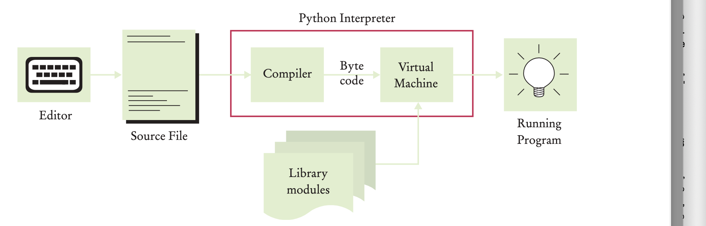

# python

- Python is a high level programming language like c, c++ and java.
- It has a much simpler and cleaner syntax than other languages.
- Python is also very portable between computer systems.
- The same Python program will run, without change, on Windows, UNIX, Linux, and Macintosh.

## Writing a simple python program

- Create a new file named hello.py and write the below content

    ```
    # My first Python program. 
    print("Hello, World!")
    ```
  
## Executing a program

- A Python program is executed using the Python interpreter.
- The interpreter reads the program and executes all of its steps.
- Open terminal and execute the command `python3 hello.py`.
- If using lower versions of python use `python hello.py`.

## Interactive mode

- The interpreter, also provides an interactive mode in which Python instructions can be entered one at a time.
- To launch the Python interactive mode from a terminal window, enter the command `python3`.
- The interface for working in interactive mode is known as the Python shell.

        Python 3.1.4 (default, Nov 3 2014, 14:38:10)
        [GCC 4.9.1 20140930 (Red Hat 4.9.1-11)] on linux
        Type "help", "copyright", "credits" or "license" for more information. 
        >>>

- The >>> at the bottom of the output is the prompt.
- After typing an instruction and press the Enter key, the code is immediately executed by the Python interpreter. For ex,

        >>> print("Hello, World!") 
        Hello World
        >>>

- Interactive mode is very useful.
- It allows experimenting and test individual Python instructions to see what happens.
- It can be used as a simple calculator.

        >>> 7035 * 0.15 
        1055.25
        >>>

## The Python Interpreter

- Typically, a compiler or an interpreter converts source code into machine code which can be executed by OS.
- Compiler converts source code into machine code and stores it in a file, so that it can be executed whenever needed.
- Interpreted languages don't store machine code in a file. Interpreter converts source code into machine code line by line during execution of the program.
- The python interpreter contains two parts
  - Compiler
    - This compiler unlike typical compilers converts source code into byte code(This is like java byte code) instead of machine code.
  - Virtual machine
    - This python virtual machine is a just-in-time compiler which converts byte code into machine code that can be executed by OS.
    - This just-in-time compiler(PVM) is not a typical interpreter. This PVM is a different software for each OS like Windows, MAC and Linux.
    - This PVM reads byte code one line at a time and translates into machine code.
    - While OS executes machine code, PVM translates byte code to machine code and saves into temp memory.
    - PVM is an improved version of interpreter because in a typical interpreter scenario while OS executes machine code interpreter sits idle.
- Source code does not contain all the information that the virtual machine needs.
  - The virtual machine locates functions such as print in library modules. Generally we need not worry about library modules.
  - When specialized tasks, such as graphics programming are required, we may need to install the required libraries. The details depend on the Python environment.
  

  